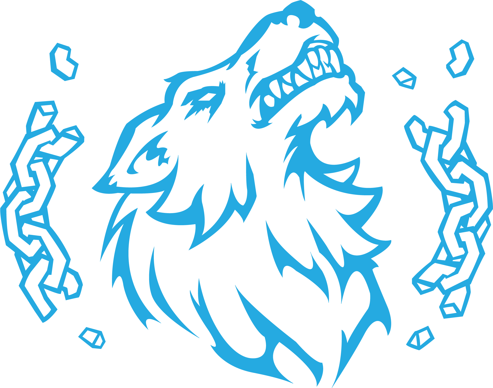

# internship
Table of contents
* Company

  * Fields of expertise
* Learning Objectives
* Portfolio
* Learning Outcome
* Conclusion

## Company
  
Fenrir Game Studio  
http://fenrirgamestudio.dk  
Naverland 2, 2600 Glostrup, Denmark  

### Fields of expertise
* Game Development
* Virtual Reality
* Augmented Reality
* Consulting
* Prototyping
* Content Creation
* Digital Design
* Concept Ideation

## Learning Objectives
These are the learning objectives I had for my internship:  


## Portfolio
This is a showcase of some of the work I did for Fenrir Game Studio. All of the work can be divided into one of the following categories with a few exceptions.
### Website
I was tasked with developing their new website. It is online here: http://fenrirgamestudio.dk 

++ I did the:
* HTML
* CSS
* PHP
* JavaScript

-- I did not do the:  

* Graphical assets
* Text  
### In-house game project
These are examples of some systems I worked with:  
* Inventory
* Frameworks
* Talents/Skills
* Grappling hook (2D vs 3D)
* Interactive objects
* Structures
* Blueprint combination and storage
### Third party game project
Because of a NDA I am not allowed to specify details about this project, suffice it to state I worked on systems such as:
* Input controls

  * Mobile
  * PC
* Interactive buildings
### VEU-spillet
Very little involvement. The sign-up page for new users is a HTML document, so I helped style that.  
Checkout the result here: http://veu-spillet.dk/Invitation/index.html
## Learning Outcome
Let's see how well the things I worked with fits into the boxes: web, Unity, agile and insight:  


## Conclusion
```ruby
public int CalculateSatisfaction(Internship atCompany) {
   return Intern.instance.GetSatisfactionByCompany(atCompany);
}
Internship atFenrirGameStudio = new Internship("Fenrir Game Studio", 2017);
int satisfaction = CalculateSatisfaction(atFenrirGameStudio);
Debug.Log(satisfaction);
```

